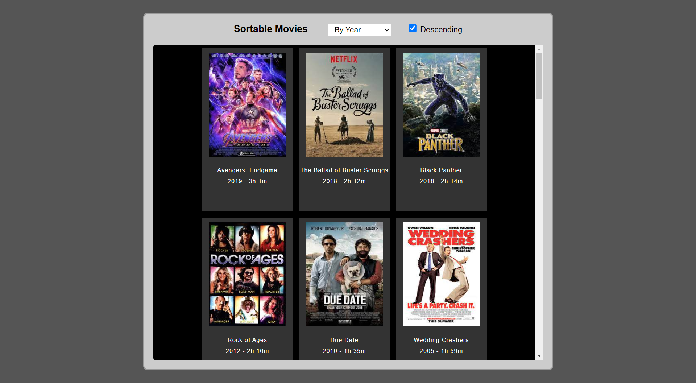

# sortMovies

## General Info
This project takes an array of given movies and is able to sort through the movies by it's name alphabetically, year, and length of movie, ascending or descending by using the selected inputs

## Technologies
This project was made with javascript.

## Deployment
Go to [https://jchen2190.github.io/sortMovies/](https://jchen2190.github.io/sortMovies/)